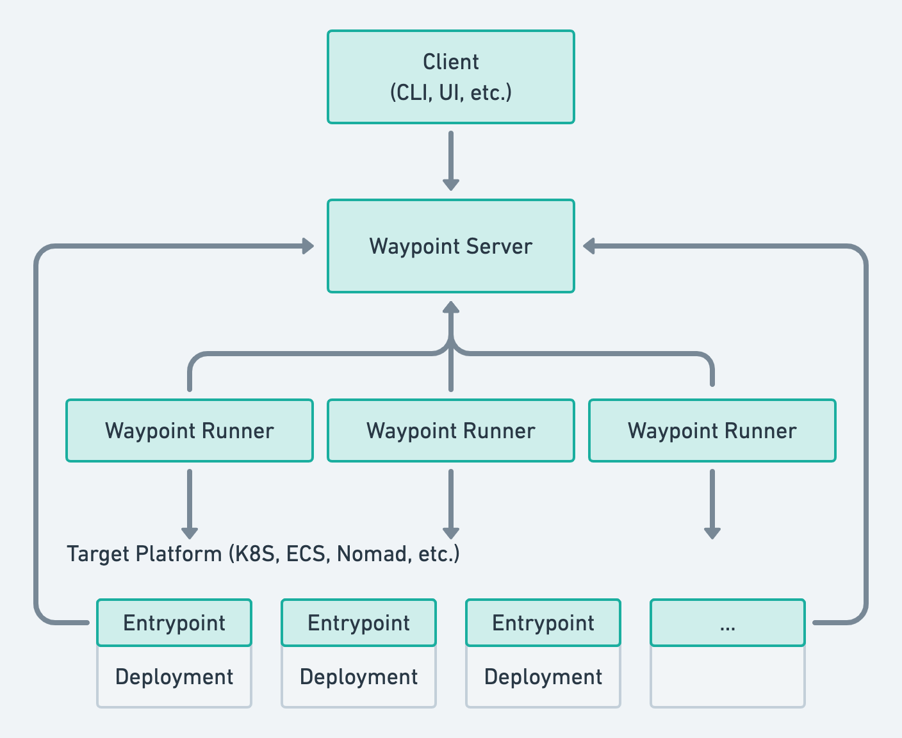

# Architecture

This document describes the high-level architecture of Waypoint. The goal
of this document is to give anyone interested in contributing to Waypoint
a high-level overview of how Waypoint works. This tries to stay high level
to guide to the right area of Waypoint, but stops short of explaining in detail
how something might work since its easy for that to get out of sync with the
codebase. The recommended usage for this doc is to use it to hone in on a
specific part of Waypoint, then study the code there for specifics.

## Table of contents

<!-- Generated from: https://luciopaiva.com/markdown-toc/ -->

- [Bird's Eye View](#birds-eye-view)
  - [Important Architectural Properties](#important-architectural-properties)
- [Code Path of a Waypoint Operation (such as `waypoint up`)](#code-path-of-a-waypoint-operation-such-as-waypoint-up)
- [Code Map](#code-map)
  - [`internal/appconfig`](#internalappconfig)
  - [`internal/auth`](#internalauth)
  - [`internal/ceb`](#internalceb)
  - [`internal/cli`](#internalcli)
  - [`internal/clicontext`](#internalclicontext)
  - [`internal/client`](#internalclient)
  - [`internal/config`](#internalconfig)
  - [`internal/core`](#internalcore)
  - [`internal/datasource`](#internaldatasource)
  - [`internal/pkg/*`](#internalpkg)
  - [`internal/plugin`](#internalplugin)
  - [`internal/runner`](#internalrunner)
  - [`internal/server`](#internalserver)
    - [`internal/server/ptypes`](#internalserverptypes)
    - [`internal/server/singleprocess`](#internalserversingleprocess)
    - [`internal/server/singleprocess/state`](#internalserversingleprocessstate)

## Bird's Eye View

At the highest level, Waypoint is made up of _four_ distinct Waypoint-specific components (colored in green above):

1. **Waypoint Client (CLI, UI, etc.)** - This is an API client focused on taking
user input and calling the correct APIs to interact with Waypoint such as
viewing a list of deployments, triggering a new deployment, etc. This communicates
only to the Waypoint server.

2. **Waypoint Server** - The main API server. This responds to all the API requests
and stores data. _This communicates directly to nothing._ The Waypoint clients, runners,
entrypoints all open an outbound connection to the server, _not_ the reverse. Therefore,
the server queues information that it then communicates to other components when they
connect.

3. **Waypoint Runners** - One or more runners which are responsible for executing 
logic for builds, deploys, etc. Importantly, these are the only components in the 
entire architecture that need access to the target platform.

4. **Waypoint Entrypoint** - An optional component a deployment may have that 
connects back to the Waypoint server for features such as application configuration,
logs, and more.

All of these components are in the `hashicorp/waypoint` GitHub repository.
The entrypoint is compiled as a separate binary `waypoint-entrypoint`, 
and the client, server, and runner are compiled as the `waypoint` binary.

### Important Architectural Properties

There are certain properties that we specifically designed for that are 
worth calling out. We'd like to preserve these properties in any improvements
to the project.

**Network access only required for the Waypoint Server.** All components
connect _out_ to the Waypoint server. The Waypoint server is the only 
component that needs to be reachable by other components. This makes it
easy to run runners, entrypoints, clients because they don't need to be
internet-reachable. This helps with security as well.

You can see this in the diagram above by the directions of the arrows.

**3rd party secrets only required by the Waypoint Runner.** Only the runner
needs access to "3rd party secrets" (anything other than a Waypoint token),
such as cloud access credentials, Kubernetes credentials, etc. Only the
runner ever interacts directly with these systems. The client interacts
with the server, and the server interacts only with runners by queueing
jobs. This decision makes the security blast radius more easily understandable.

Note that the Waypoint server can _optionally_ have 3rd party secrets
in the form of [application and runner configuration](https://www.waypointproject.io/docs/app-config),
but users can choose to opt out of this. The runners _need_ secrets
to be practically useful.

You can see this in the diagram above by noting that only runners talk 
to the target platforms.

**The only component with persistent data is the Waypoint Server.** The 
server is the only component that persists data beyond restarts. It is
also the only component that has direct access to the database. All
other data storage and access must go through APIs to the server.
This property is very nice because the client, runner, and entrypoints
are all stateless. They can be safely restarted and they will reconstruct
their state. This makes operating a Waypoint cluster simpler.

## Code Path of a Waypoint Operation (such as `waypoint up`)

The list below shows a high-level overview of the code path of a
full end-to-end `waypoint up` operation. It is similar for other
operations such as `waypoint build` or `waypoint logs` but with
subtle differences.

This isn't meant to be an overview of our internal packages. 
The important internal packages are covered in a lot more
detail in the "Code Map" section. The goal of this instead is
to just give you a sense of how the code "flows".

CLI:

1. `cmd/waypoint`: CLI entry `waypoint up`
2. `internal/cli`: CLI logic
3. `internal/client`: High-level API client to interact with the Waypoint server

Server:

4. `internal/server/singleprocess`: Server-side API request logic
5. `internal/server/singleprocess/state`: Server-side persistant storage logic

Runner: 

6. `internal/runner`: Runner-side accept and execute jobs
7. `internal/core`: Runner-side core Waypoint logic

Entrypoint:

8. `internal/ceb`: Entrypoint logic for deployed applications

The code path of `client => server => runner` is a common pattern 
throughout many operations within Waypoint. The entrypoint can be
considered a special kind of client. Operations only ever flow in this
direction. From a code standpoint, at the highest level, it is
`internal/client`, `internal/server`, `internal/runner`, then
`internal/core`. This is the most common call path in Waypoint.

## Code Map

This section goes through the various paths and packages in the
Waypoint repository and documents what their purpose is and some
invariants and design decisions around these packages that should 
be held true.

The package ordering is alphabetical. Some packages are omitted
if they're trivial or otherwise unimportant.

**Note:** All Go packages should have package documentation, so you
can use `godoc` to view more information about a package.

### `internal/appconfig`

Package appconfig provides the logic for watching and reading application
configuration values. Application configuration values may be static
or they may be dynamically loaded from external systems such as Vault,
Kubernetes, AWS SSM, etc. Application configuration can be key/values
or might be configuration files.

This package runs for both the entrypoint for deployments AND for
runners (and maybe more in the future). Because the package is generic,
it allows us to expose our "config" functionality easily to multiple
types of users.

**Architecture Invariant:** This package is independent of the mechanism
by which configuration is loaded from the server. This allows config vars
to come from different APIs easily, and also makes unit testing easy.

**Architecture Invariant:** This package is independent of how configuration
is physically exposed; it does not set env vars or physically write files.
It exposes only structures that the caller can use to write env vars or files.
This makes it easy to use in different contexts (runners, entrypoints, locally).

### `internal/auth`

Package auth contains helpers for both the server and client-side for
autenticating with the Waypoint server. 

### `internal/ceb`

Package ceb contains the core logic for the Waypoint Entrypoint. It is called
"ceb" because during the earliest Waypoint design, we called the Entrypoint
the "custom entrypoint binary." This package is the primary entrypoint for 
the entrypoint.

**Architecture Invariant:** This package is not intended to be a reusable
package by other components; it is only meant to encapsulate the entrypoint
for the entrypoint. If there is reusable logic desired in this package, it should
be extracted into another package. For example, this is how `internal/appconfig`
came to be: we originally only did app-only config, then we extracted it to
support runner config.

### `internal/cli`

Package cli contains the main entrypoint and logic for the CLI. 

**Important note:** The CLI is our least unit-tested package. We have experience
testing CLIs but we did a poor job of testing this one. Because of this, any
testable logic should go into a separate package or extracted into a standalone
unexported function within this package to be unit tested. For example, we
extracted `internal/clicontext` because (1) we can fully unit test it and 
(2) it is theoretically useful to reuse although we don't today.

### `internal/clicontext`

Package clicontext implements the logic around CLI "contexts". A context
encapsulates the current configuration that applies to every CLI command
such as server address, server authentication, etc. Contexts are persisted
on the user machine.

### `internal/client`

Package client implements a high-level library for interacting with
the Waypoint server. Rather than at a direct API level, the interface
for this package is at an operation level. This is used by the CLI, but
in theory can be used by other frontends.

**Architecture Invariant:** The client package cannot expect a `waypoint.hcl`
file or any project sources, because the client can also operate purely
on remote projects in the server. 

### `internal/config`

Package config implements the `waypoint.hcl` configuration structure
and parser. This also implements the parser for Waypoint input variables
(such as `wpvars` files).

**The runner _should_ be the only component that parses a `waypoint.hcl`
file.** Because we regularly introduce new features into the `waypoint.hcl`
file, we don't want to force users to upgrade every component to use
the latest version of Waypoint. Therefore, we should attempt to only ever
parse `waypoint.hcl` files in the runner.

### `internal/core`

Package core implements the core logic of Waypoint that actually executes
things such as builds, deploys, etc. This core package parses `waypoint.hcl`
files, starts and invokes plugins, and sends results to the server. This is
the package used by runners to actually invoke the logic.

The `core` package APIs are somewhat similar to the `client` package. The
main difference is the `client` package executes operations such as build
by queueing a job with the server and waiting for it to execute. The core
package actually executes the operations (usually via a runner).

### `internal/datasource`

Package datasource implements the logic around downloading project 
data from external VCS sources. 

### `internal/pkg/*`

The packages in `internal/pkg` are reusable packages that could in theory
be extracted into separate repositories and be useful to projects
other than Waypoint. For example, `internal/pkg/signalcontext` is a
simple package for canceling a Go `context.Context` in response to an OS
signal. This has nothing to do with Waypoint and you could imagine other
projects may want to use this. While the package isn't usable externally
in the `internal/` directory, we could in theory extract it or other Go users
could just copy it out.

### `internal/plugin`

The plugin package is responsible for working with plugins: finding,
loading, and invoking plugins. 

**Architecture Invariant:** This package should be independent of
parsing Waypoint configuration, using the Waypoint server API, etc.
(unless it directly relates to plugins). This is similar to `appconfig`
which depends on downstream users to determine _how_ config is
loaded AND used.

### `internal/runner`

Package runner implements the main logic for runners and is the primary
entrypoint for runners (`waypoint runner` uses this package). This package
is mainly concerned with job management around runners; it uses `internal/core`
to execute Waypoint-specific business logic.

### `internal/server`

Package server implements the Waypoint server and associated helper packages.
This contains the main API implementation and persistent storage implementation.
This package is so important and so large that its useful to dive into the 
sub-packages:

#### `internal/server/ptypes`

Package ptypes contains helper functions for working with the various
protobuf types that the server API uses. For example, this contains helpers
for mock data creation, data validation, data conversion, etc.

**Architecture Invariant:** This package should be independent of how the
server is implemented (i.e. as a single process gRPC service, as a 
SQL-backed data store, whatever). This package is generally useful to
anyone trying to implement a Waypoint server.

#### `internal/server/singleprocess`

This is the main current implementation of the Waypoint server. This is
a Waypoint server designed to be single process only; this server implementation
is never intended to become multi-process (i.e. horizonally scalable). 

#### `internal/server/singleprocess/state`

Package state in the singleprocess folder contains the logic for state
management based on MemDB and BoltDB. This is the primary mechanism for
state in the single-process server implementation.

Due to the style of this package, it has extremely high test coverage. 
Any changes to this package should contain full coverage.

**Architecture Invariant:** This package should be implemented using
relatively simple CRUD-like operations on data. More complex logic
is expected to be in the server implementation.
