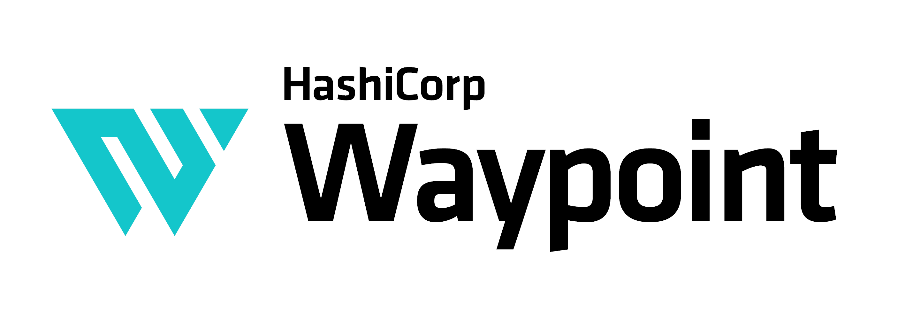

----------------------------------------

# Waypoint

* Website: https://www.waypointproject.io
* Tutorials: [HashiCorp Developer](https://developer.hashicorp.com/waypoint/tutorials)
* Forum: [Discuss](https://discuss.hashicorp.com/c/waypoint)

Waypoint allows developers to define their application build, deploy, and release lifecycle as code, reducing the time to deliver deployments through a consistent and repeatable workflow.

Waypoint supports a number of build methods and target platforms out of the box
and more can be easily added via plugins:

* Cloud Native Buildpacks
* Docker
* Kubernetes
* AWS EC2 and ECS
* Azure Container Instances
* Google Cloud Run
* And many more...

Waypoint runs on Linux, Mac OS X, and Windows.

**Please note**: We take Waypoint's security and our users' trust very seriously. If you
believe you have found a security issue in Waypoint, please [responsibly disclose](https://www.hashicorp.com/security#vulnerability-reporting) by
contacting us at security@hashicorp.com.

## Quick Start

A [quick start guide](https://developer.hashicorp.com/waypoint/docs/getting-started) is available on HashiCorp Developer. You can also find [tutorials](https://developer.hashicorp.com/waypoint/tutorials) which cover topics ranging from getting started guides to more advanced usage.

* [Getting Started](https://developer.hashicorp.com/waypoint/docs/getting-started)
* [Introduction](https://developer.hashicorp.com/waypoint/tutorials/get-started-docker/get-started-intro)
* [Installation](https://developer.hashicorp.com/waypoint/tutorials/get-started-docker/get-started-install)
* [Docker](https://developer.hashicorp.com/waypoint/tutorials/get-started-docker/get-started-docker)
* [Kubernetes](https://developer.hashicorp.com/waypoint/tutorials/get-started-kubernetes/get-started-kubernetes)
* [Nomad](https://developer.hashicorp.com/waypoint/tutorials/get-started-nomad/get-started-nomad)
* [Waypoint UI](https://developer.hashicorp.com/waypoint/tutorials/get-started-docker/get-started-ui)
* [AWS ECS](https://developer.hashicorp.com/waypoint/tutorials/deploy-aws/aws-ecs)
* [Azure Container Instance](https://developer.hashicorp.com/waypoint/tutorials/deploy-azure/azure-container-instance)
* [Google Cloud Run](https://developer.hashicorp.com/waypoint/tutorials/deploy-google-cloud/google-cloud-run)

## Documentation

Full, comprehensive documentation is available on HashiCorp Developer:

https://developer.hashicorp.com/waypoint/docs

## Contributing

Thank you for your interest in contributing! Please refer to [CONTRIBUTING.md](https://github.com/hashicorp/waypoint/blob/master/.github/CONTRIBUTING.md) for guidance.

### Installing Dependencies

This repository contains a couple of different ways to automate installing the
required Golang packages needed to build Waypoint locally. You can either use
[NixOS](https://nixos.org/), or run `make tools` to setup the
required packages.

### Running the unit tests

To run the entire test suite, you'll want to ensure that you've brought up
all the required containers used for testing. You can do this by leveraging
the existing `docker-compose.yml` file that's in the root directory of this
project:

```
$ docker-compose up
```

After running this, you should have a local Horizon container along with a few
other services needed for running the tests:

```
$ make test
```

#### Running individual tests

If you don't want to run the entire test suite, you can just run a singe test
with go. For example, if you wanted to run the tests ListInstances, you would
run:

```
$ go test -run ListInstances -v ./internal/server/singleprocess
```
