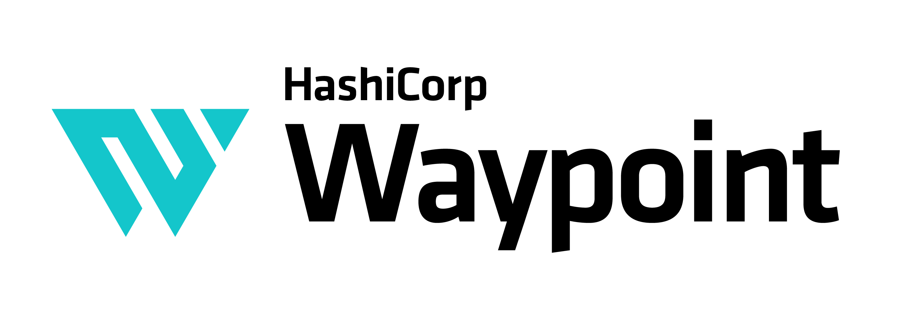

----------------------------------------

# Waypoint

* Website: https://www.waypointproject.io
* Tutorials: [HashiCorp Learn](https://learn.hashicorp.com/waypoint)
* Forum: [Discuss](https://discuss.hashicorp.com/c/waypoint)

Waypoint allows developers to define their application build, deploy, and release lifecycle as code, reducing the time to deliver deployments through a consistent and repeatable workflow.

Waypoint supports a number of build methods and target platforms out of the box
and more can be easily added via plugins:

* Cloud Native Buildpacks
* Docker
* Kubernetes
* AWS EC2 and ECS
* Azure Container Instances
* Google Cloud Run
* Netlify
* And many more...

Waypoint runs on Linux, Mac OS X, and Windows.

**Please note**: We take Waypoint's security and our users' trust very seriously. If you
believe you have found a security issue in Waypoint, please [responsibly disclose](https://www.hashicorp.com/security#vulnerability-reporting) by
contacting us at security@hashicorp.com.

## Quick Start

A few quick start guides are available on the [Waypoint website](https://www.waypointproject.io/docs/getting-started)
and on [HashiCorp Learn](https://learn.hashicorp.com/waypoint):

* [Getting Started](https://www.waypointproject.io/docs/getting-started)
* [Introduction](https://learn.hashicorp.com/tutorials/waypoint/get-started-intro)
* [Installation](https://learn.hashicorp.com/tutorials/waypoint/get-started-install)
* [Docker](https://learn.hashicorp.com/tutorials/waypoint/get-started-docker)
* [Kubernetes](https://learn.hashicorp.com/tutorials/waypoint/get-started-kubernetes)
* [Nomad](https://learn.hashicorp.com/tutorials/waypoint/get-started-nomad)
* [Waypoint UI](https://learn.hashicorp.com/tutorials/waypoint/get-started-ui)
* [AWS ECS](https://learn.hashicorp.com/tutorials/waypoint/aws-ecs)
* [Azure Container Instance](https://learn.hashicorp.com/tutorials/waypoint/azure-container-instance)
* [Google Cloud Run](https://learn.hashicorp.com/tutorials/waypoint/google-cloud-run)

## Documentation

Full, comprehensive documentation is available on the Waypoint website:

https://www.waypointproject.io/docs

## Contributing

Thank you for your interest in contributing! Please refer to [CONTRIBUTING.md](https://github.com/hashicorp/waypoint/blob/master/.github/CONTRIBUTING.md) for guidance.

### Installing Dependencies

This repository contains a couple of different ways to automate installing the
required Golang packages needed to build Waypoint locally. You can either use
[NixOS](https://nixos.org/), or run `make tools` to setup the
required packages.
