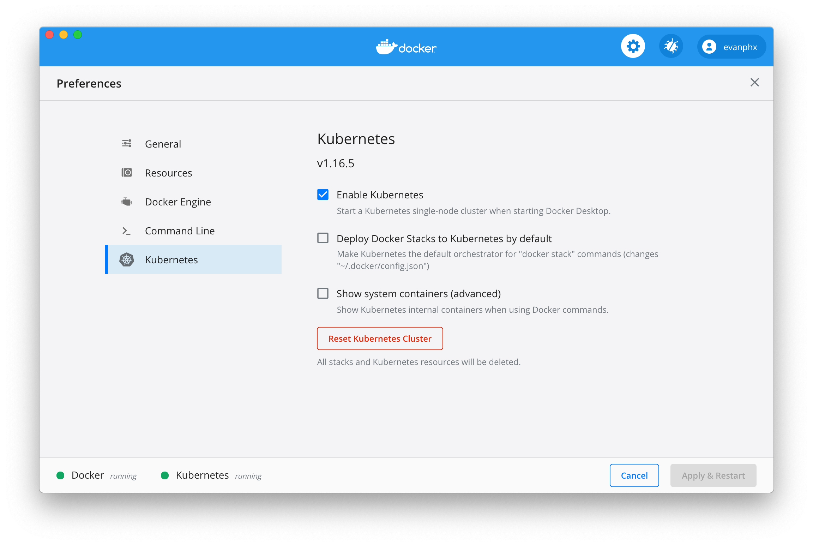

## Waypoint

Waypoint is a deployment tool, there are many like it, but it is ours.

## Running Waypoint on Docker for Mac Kubernetes

1. Enable Kubernetes in the Docker for Mac configuration
    1. 
1. Configured kubernetes to access the github docker registry
    1. https://help.github.com/en/packages/using-github-packages-with-your-projects-ecosystem/configuring-docker-for-use-with-github-packages#authenticating-to-github-packages
    1. `kubectl create secret docker-registry github --docker-server=docker.pkg.github.com --docker-username=$GITHUB_USER --docker-password=$GITHUB_PASSWORD --docker-email=$GITHUB_EMAIL`
1. Download or build waypoint
    1. https://github.com/hashicorp/waypoint/releases/download/v0.1.0/waypoint-darwin-0.1.0.zip
1. Create a Waypoint URL Service account:
    1. `waypoint account register --email $MY_EMAIL --accept-eula`
    1. The output will include a token to use. Set this token to WAYPOINT\_URL\_TOKEN in your environment:
    1. `export WAYPOINT_URL_TOKEN=<token output by previous step>`
1. Create a Waypoint URL Service host:
    1. `waypoint hostname register -l service=wpmini,env=dev`
    1. This will output an autogenerated hostname to use. You can pass pass your own hostname to the above command by adding `--name thenameyoudesire`.
1. Run `waypoint install` to install the server into your cluster
    1. Check that the server is running: `kubectl get pod -l app=waypoint-server`
    1. It should transition to Running after downloading the image. If the status is `ImagePullBackOff`, then there is something incorrect with your docker registry secret. Check it is configured correctly.
1. Add a simple docker registry to your install:
    1. `docker run -d -p 5000:5000 --restart=always --name registry registry:2`
1. Go to test-apps/wpmini
1. Perform the build: `waypoint build`
1. Perform the deploy: `waypoint deploy`
    1. TODO: Make Ctrl-C cancel the deploy properly if waiting on the pods to start
1. Perform the release: `waypoint release`
1. See the app running: `curl localhost:8080`
1. View the logs of the app: `waypoint logs`
1. Show how config is plumbed:
    1. Run `waypoint config set NAME=ptr`. You can substitue `ptr` for your name or any name.
    1. Run `waypoint deploy`
    1. Run `waypoint release`
    1. See the response change: `curl localhost:8080`
1. Access the app via the Waypoint URL Service by accessing the hostname output by `hostname register`
    1. `curl https://somename.alpha.waypoint.run`
