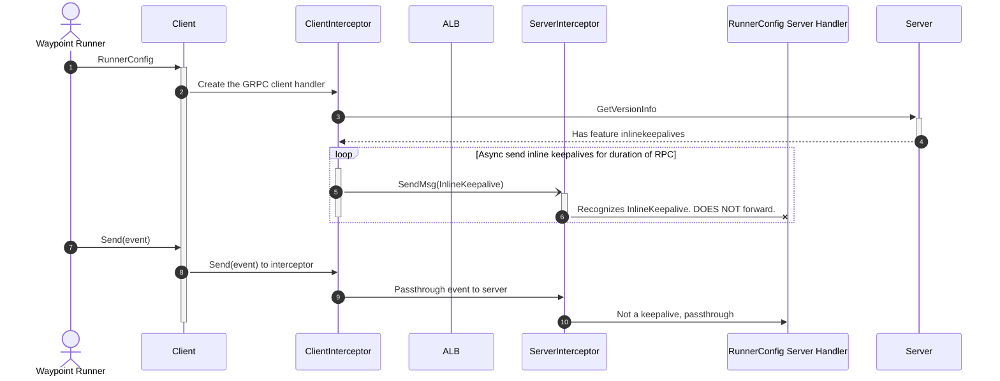
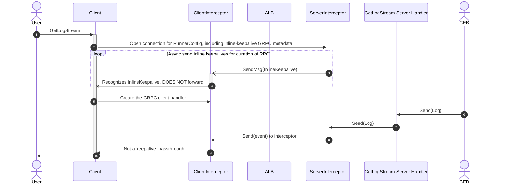

# inlinekeepalive

inlinekeepalive is a package that sends "keepalive" messages over
existing grpc streams. See `doc.go` for full package description

## Diagrams

These diagrams demonstrate the intended usage of inline keepalives within Waypoint.

### ClientStream

### ServerStream

